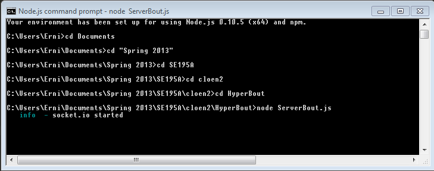
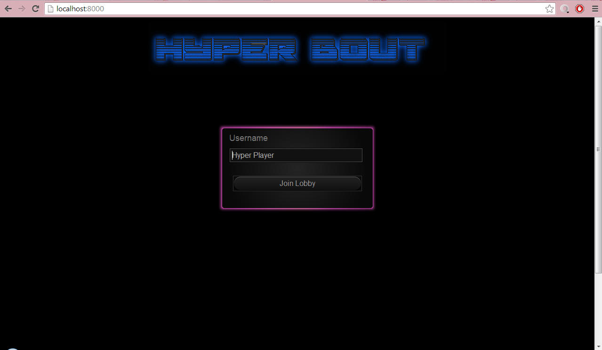
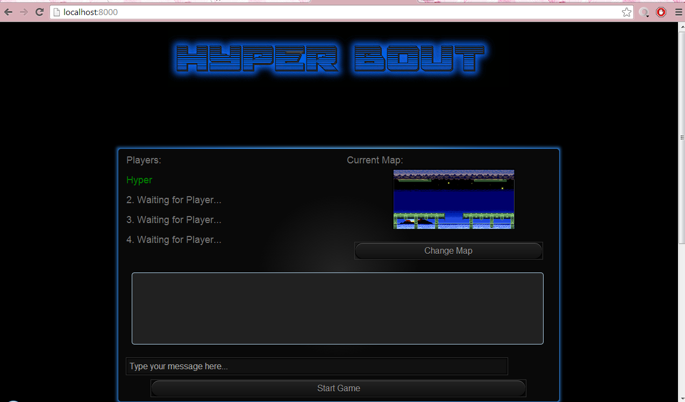
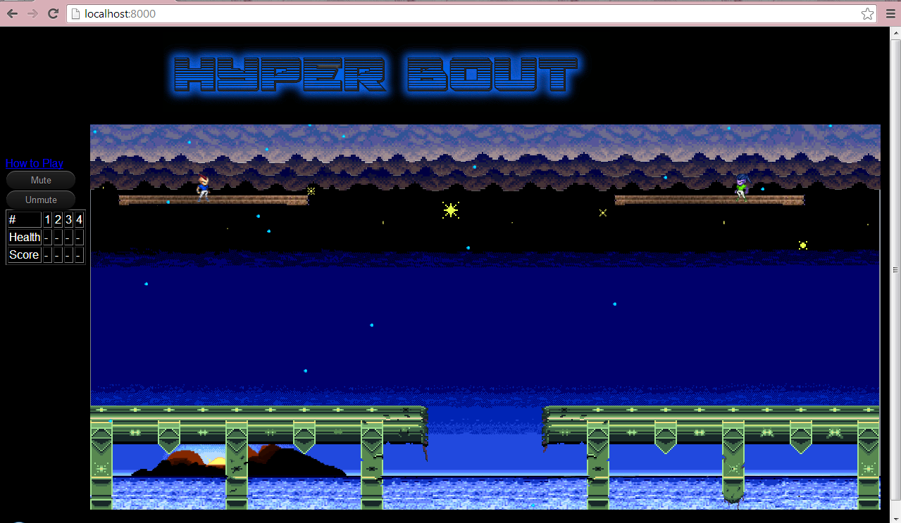

# Hyper Bout

Hyper Bout is a multiplayer 2D competitive game that is completely open source and utilizes technologies such as HTML5, Node.JS (socket.io and express), Javascript, jQuery, and Box2D. 

The testing aspect of Hyper Bout uses the Jasmine BDD framework and selenium. 

Hyper Bout is created by three students in San Jose State University as an undergraduate capstone project in Software Engineering major. They are: 
- Erni Ali
- Phil Vaca
- Randy Zaatri

## Prerequisites
You need to already have installed nodejs on your machine. http://nodejs.org/download/

## How to Run
* Open up Node.js Command Prompt and change to directory of game
* Then, start the HyperBout server by typing in “node ServerBout.js”

* Open your web browser and go to localhost:8000

* You need at least two players to start the game. Enter your name and select start game. 

* Do the same on another web browser window. The game will start with two players. 

* To start a game with 3 or more players, simply leave the players in the lobby and hit start when all players are in the lobby.

## How to Play
You need mouse and keyboard to play:
- 'a' key to move left. 
- 'd' key to move right
- left click to shoot projectiles
- space to jump

## Objective
The objective of the game is to damage other players and gain points. You only receive a point when you completely deplete other player's health. You win when you receive two points. 

## Running on one machine or on LAN
The default of the code is to run on one machine where you start the game using node.js and go to localhost:8000. However, if you're interested in running the project using LAN on a router, you can change HyperBout.js line 43 so that it connects to the correct IP address.

## Server Side Folders Instruction
### Folders and Files
List of Folders: 
* /  (root)
  * Contains all files needed to run on the server
* Examples: 
  * Contains example projects that the team looks at for ideas. (Currently has basic Node game you can run with Code Source for explanation)
* node_modules: 
  * Contains socket.io and express library [No need to touch]
* public: 
  * Contains files that will be run on the user's machine
* archive:
  * contains files of older versions that are no longer in use
* z_HyperBoutNoLobby:
  * The game before it is integrated with the lobby. For testing purpose. 

JS Files:
* ServerBout.js: 
  * Starting node application js file
* ServerPlayer.js: 
  * Player class of whose data will be sent from client to/from host
* HyperPlayer.js: 
  * The client Hyper Bout file. It controls the local player. 
* HyperBout.js: 
  * The client core engine file that controls all in-game logic. 
* HyperPowerUp.js: 
  * The client class that controls the power ups. Only health power up is currently implemented